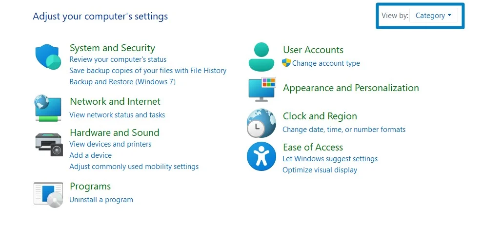
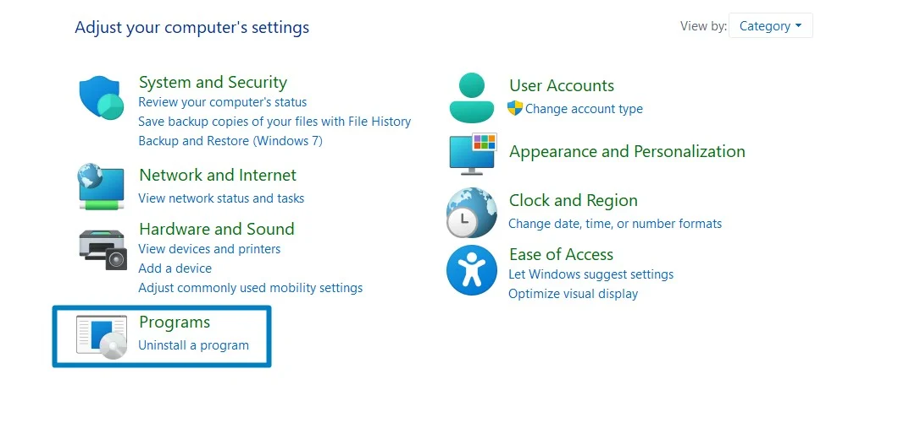
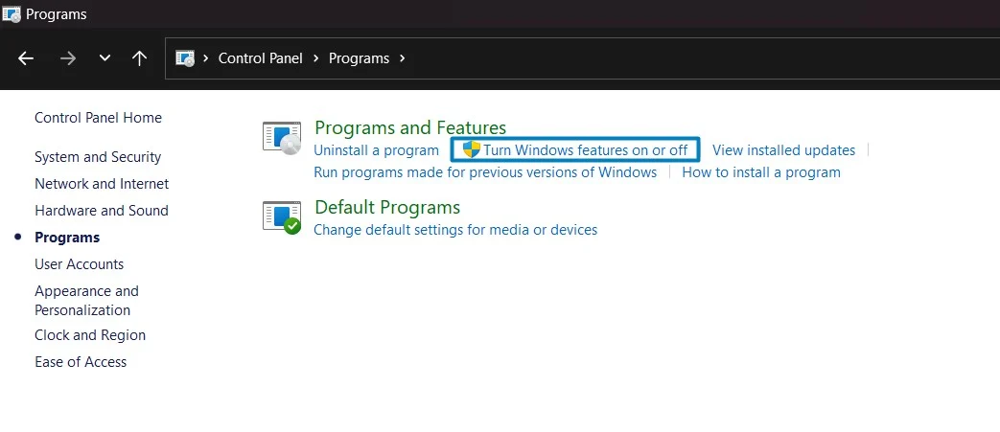
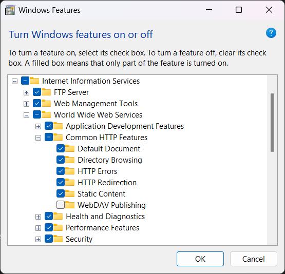
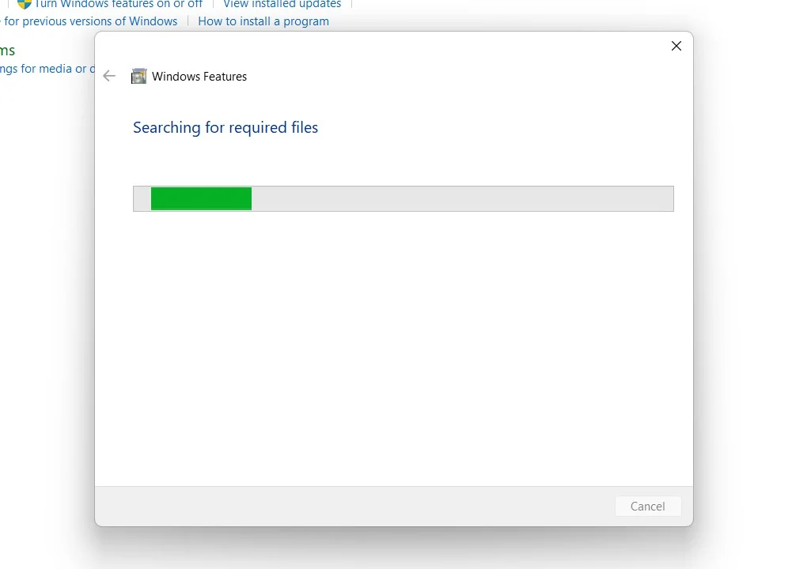
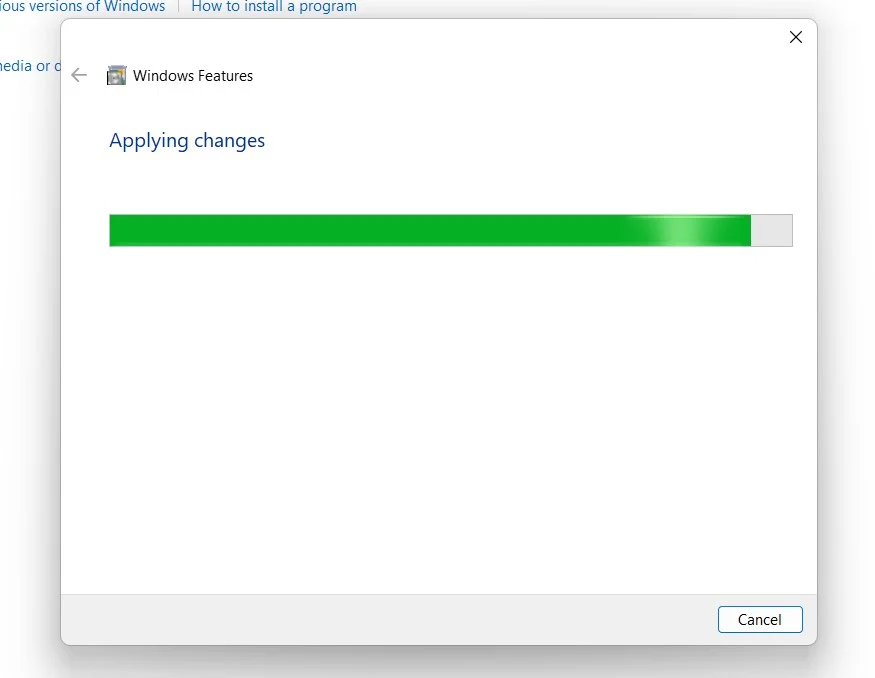
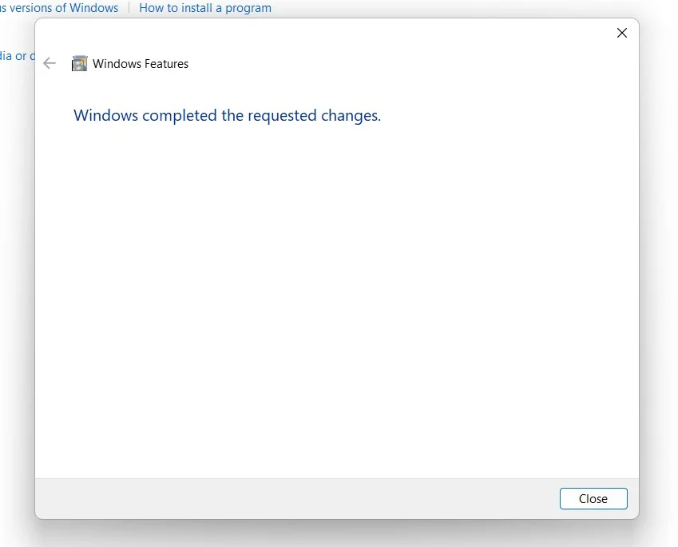
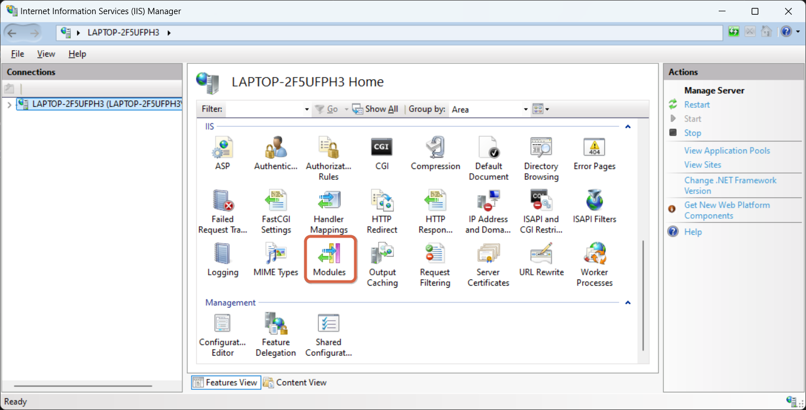
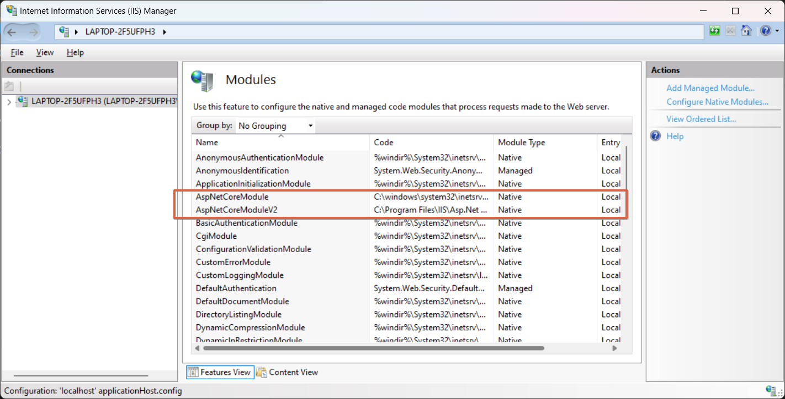

# Steps to publish Blazor App on IIS

<div id="top"></div>

## Table of Contents:

- ✨[About](#✨about)
- 📃[Installing the .NET core hosting bundle](#📃validations-samples)
- 📃[Enable IIS in Windows 11](#📃enable-iis-in-windows-11)
  - 📃[Enable IIS in Windows 11](#📃enable-iis-in-windows-11)
- 📃[Troubleshooting common hosting issues](#📃troubleshooting-common-hosting-issues)
- 📚[Acknowledgments](#📚acknowledgments)

## ✨About

JSON Schema is a declarative language for annotating and validating JSON documents' structure, constraints, and data types. It provides a way to standardize and define expectations for JSON data.

>[!NOTE]
   >
   >The JSON Schema team recommends using draft 7 or later. The current version is 2020-12! The previous version was 2019-09.

All the examples listed below have the same structure but for the sake of brevity, we will only be showing the code snippet corresponding to the validation segment:

```json

{
  "$schema": "https://json-schema.org/draft/2020-12/schema",
  "$id": "https://example.com/product.schema.json",
  "title": "Your title",
  "description": "Your description",
  "type": "object",
  "additionalProperties": false,
  "required": [ ... ],
  "properties": {
    "prop1": {
    },
    "prop2": {
    },
    "prop3": {
    },
    "propn": {
    }
  },
  "definitions": {
    "definition-1": {
    },
    "definition-2": {
    },
    "definition-n": {
    }
}

```

## 📃Validations samples


<p align="right"><a href="#top">☝</a></p>

## 📃Enable IIS in Windows 11

### Quick Steps:

1- Click on the Start Menu and open the Control Panel.

2- Switch the Control Panel view to Category.



3- Now, Click on Programs.



4- Under Programs and Features, click on Turn Windows Features on or off.



5- Windows Features dialog box will open now. From the list of services available, search and locate Internet Information Services.

6- Click on the checkbox next to the Internet Information Services and then click on OK.



Make sure you check all the options except the one that appears unchecked.

7- Windows 11 will search for the required files.



8- After the process, Windows will apply the necessary changes.



9- The system will prompt for a restart. Continue with Restart now. It is recommended so that changes made to the system reflect while using the environment. Click Close.



10- That is it, Internet Information Services [IIS] is now enabled in your Windows 11 laptop or PC.

<p align="right"><a href="#top">☝</a></p>

## 📃Troubleshooting common hosting issues

### In this section, we will look into some of the common problems that you can face while hosting a Blazor application:

1- Once the prerequisites in step 2 have been installed, you must ensure that the following modules appear enabled in IIS:

  

  

  If these modules do not appear, proceed as follows:

  1.1- Open the windows command line with administrative privileges:

  1.2- Navigate to inetSrv location: 

  ```cmd
    cd C:\Windows\System32\inetsrv
  ```

  1.3- Run the following command to install the 'aspnetcore' module. You should get output similar to the following:
 
  ```cmd
    C:\Windows\System32\inetsrv>appcmd.exe install module /name:AspNetCoreModule /image:%windir%\system32\inetsrv\aspnetcore.dll
    GLOBAL MODULE object "AspNetCoreModule" added
    MODULE object "AspNetCoreModule" added
  ```

  1.4- Run the following command to install the 'aspnetcorev2' module. You should get output similar to the following:
 
  ```cmd
    C:\Windows\System32\inetsrv>appcmd.exe install module /name:AspNetCoreModuleV2 /image:"%ProgramFiles%\IIS\Asp.Net Core Module\V2\aspnetcorev2.dll"
    GLOBAL MODULE object "AspNetCoreModuleV2" added
    MODULE object "AspNetCoreModuleV2" added
  ```

  Once these steps have been completed, check again that the previously mentioned modules appear.
2- 

<p align="right"><a href="#top">☝</a></p>

## 📚Acknowledgments

- [How to Enable IIS [Internet Information Services] in Windows 11?](https://winsides.com/enable-internet-information-services-iis-in-windows-11/)
- [Deploying A Blazor Application On IIS](https://www.c-sharpcorner.com/article/deploying-a-blazor-application-on-iis/)
- []()
- []()
- []()
- []()
- []()
- []()
- []()
- []()
- []()
ssdfsdf